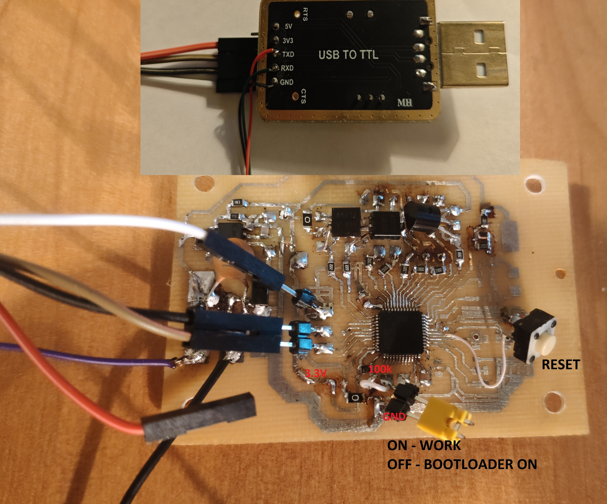

# Display board for the charger STM32F103C6T6
The board displays the current, voltage and controls the fan rotation. When the battery voltage reaches 14.7 volts, the indicator starts flashing.
The voltage and current on the indicator switch automatically every 5 seconds.

It was necessary to charge the LiFePol battery 100Ah. I bought a power supply for a LED strip(12v 29A) and redid it.

I added a 10A current limiter based on the LM358.
The first part of the chip amplifies the voltage for TL494,
the second part - for STM32 board.

Bottom board

The next step is to make an indication board and write the firmware for it.
I used sprint layout 6.

Load firmware use flash loader demo and CH340G .

Board with firmware

Result - charger

Last binary file you found in
./binary

Board design in ./board 

Battery charge current 10А.