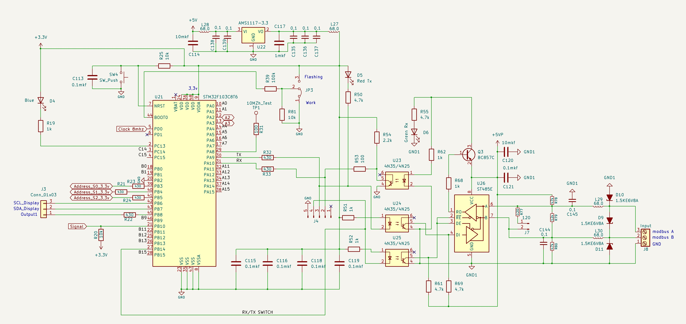
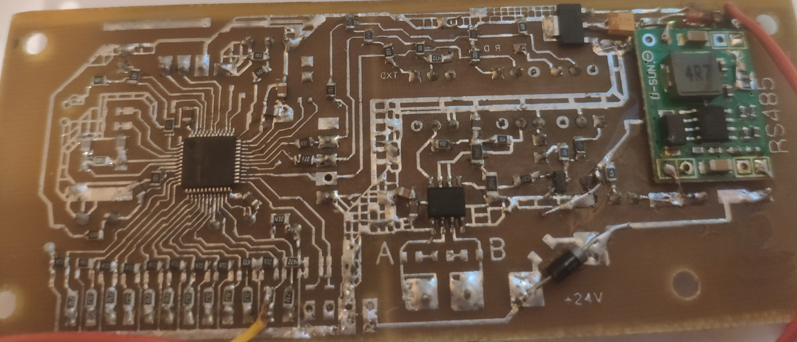
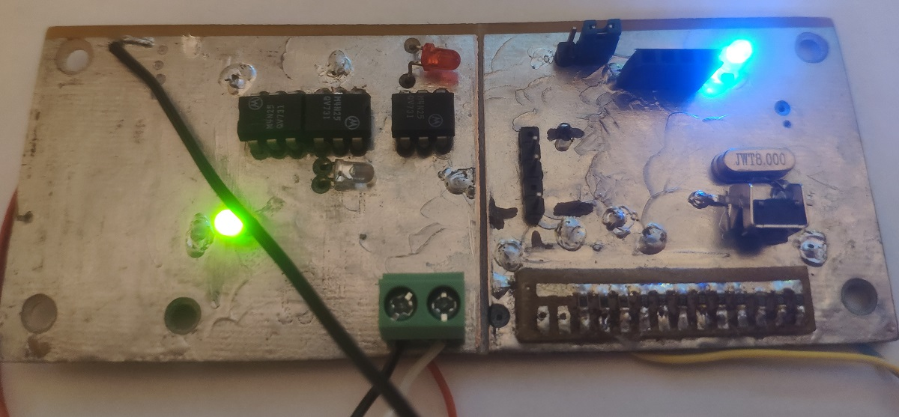

# FrequencyMeter
*С language STM32 freq meter with modbus*

When making homemade wind turbines, it is required to take into account their characteristics, efficiency and other parameters.
An important device for these purposes is a frequency counter. Based on the rotation speed, you can calculate the parameters and compare them with the real ones.
This makes it possible to identify errors in the design of such devices.

For these purposes, a frequency counter was developed on the STM32F103C6T6 microcontroller, and later migration to the STM32F103C8T6.
The highest accuracy is achieved in the frequency range from 700 Hz to 1 Hz.
The frequency meter measures the period of the signal, the fill frequency is 72 MHz. This allows fast and accurate measurement of low-frequency signals up to 1 Hz.

Two timers, TIM2 and TIM3, are used as a counter, forming a 32-bit counter.

To receive the data, a computer program has been written on C# via RS485.

More than 20 devices have been manufactured.
The circuit diagram of the device is shown in the figure

Test some board versions.

Top board

Button board

Сomputer program window

For development use Visual Studio Code.
The binary firmware files can be found in folder 
_./binary_

To check the frequency meter, use low-frequency 
step signal generator
from my repo(/Stm32Projects/LfSignalGenerator)