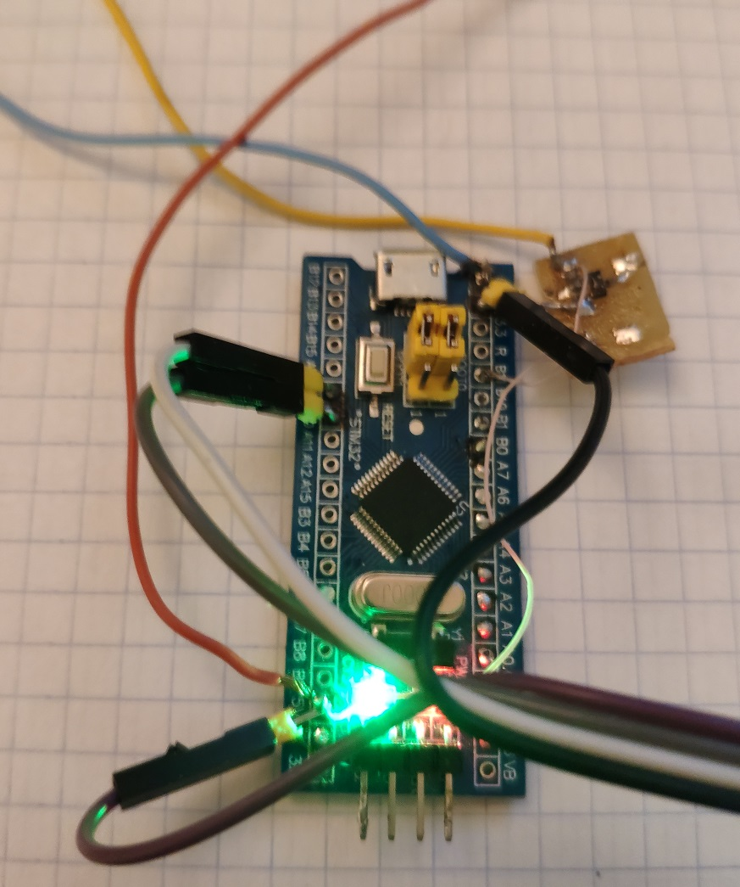
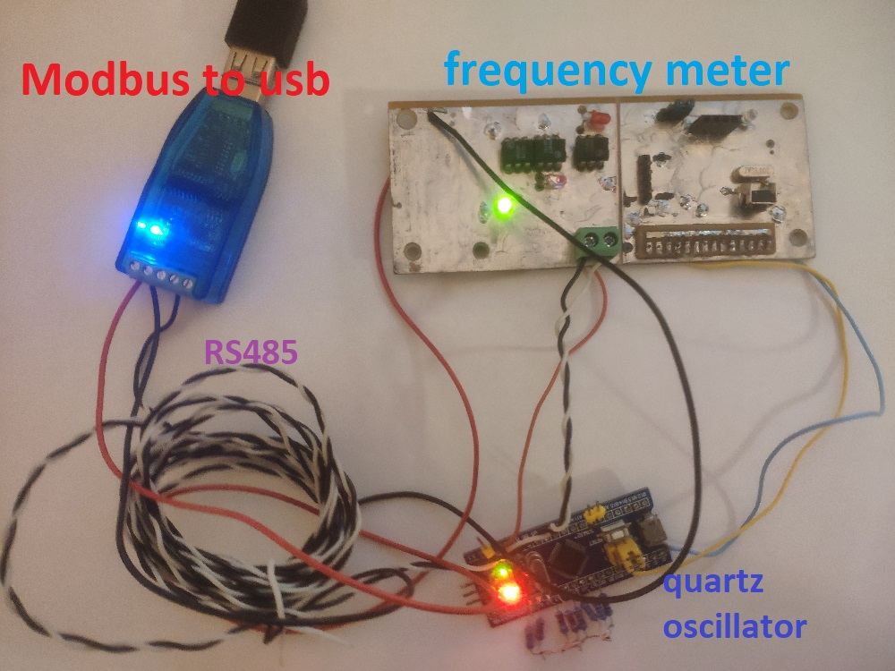
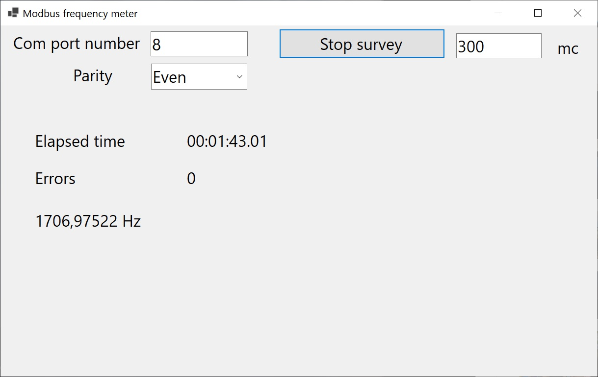

# Stm32Projects
Projects on microcontroller STM32 

## LfSignalGenerator

Low-frequency step signal generator in the range from 3567Hz to 0.1 Hz.

It generated square pulse.
The frequency decreases every 12 seconds.

This allows you to test various signal amplifiers or optical isolators.

Folder \LfSignalGenerator\STM32F103C6T6 contains a project for a microcontroller STM32F103C6T6

Folder STM32F103C8T6 for a microcontroller STM32F103C8T6.

The signal is generated at the output PB11.

The generated frequency list can be found in the file \LfSignalGenerator\FrequencyTable.txt

## Low frequency meter for wind generator

When setting up a wind turbine, you need a frequency meter with the
 ability to measure the  rotation speed in the range of 1-100 Hz.
This device allows you to monitor the operation of the wind turbine in real time,
and check the parameters of new developments.

An external computer and .Net program are used for monitoring.
This device can also be used to measure engine speed(need convert Hz to RPM).

Сomputer program window

[More](./FrequencyMeter/doc/README.md)
