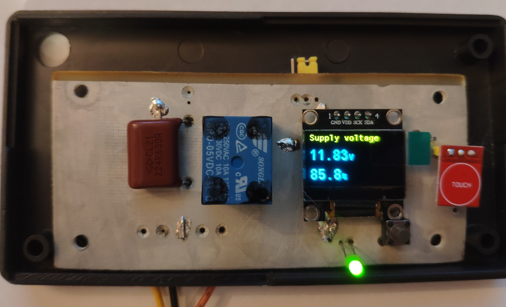

# Stm32Projects
Projects on microcontroller STM32 

## Turning off the hard drive when the battery is low

My DVR is powered by 12 volts.
When the power is turned off,
 the device is powered by a lithium battery.

If the battery is discharged to 10 volts, the hard drive starts clicking.
To prevent this from happening, we turn off the DVR's power at 10 volts.

[More](./TurningOffBatteries/README.md)

## LfSignalGenerator

Low-frequency step signal generator in the range from 3567Hz to 0.1 Hz.

It generated square pulse.
The frequency decreases every 12 seconds.

This allows you to test various signal amplifiers or optical isolators.

Folder \LfSignalGenerator\STM32F103C6T6 contains a project for a microcontroller STM32F103C6T6

Folder STM32F103C8T6 for a microcontroller STM32F103C8T6.

The signal is generated at the output PB11.

The generated frequency list can be found in the file \LfSignalGenerator\FrequencyTable.txt

## Low frequency meter for wind generator

When setting up a wind turbine, you need a frequency meter with the
 ability to measure the  rotation speed in the range of 1-100 Hz.
This device allows you to monitor the operation of the wind turbine in real time,
and check the parameters of new developments.

An external computer and .Net program are used for monitoring.
This device can also be used to measure motor speed(need convert Hz to RPM).

Сomputer program window

[More](./FrequencyMeter/README.md)

## Display board for the charger STM32F103C6T6
The board displays the current, voltage and controls the fan rotation. When the battery voltage reaches 14.7 volts, the indicator starts flashing.
The voltage and current on the indicator switch automatically every 5 seconds.

It was necessary to charge the LiFePol battery 100Ah. I bought a power supply for a LED strip(12v 29A) and redid it.

[More](./ChargeController/README.md)