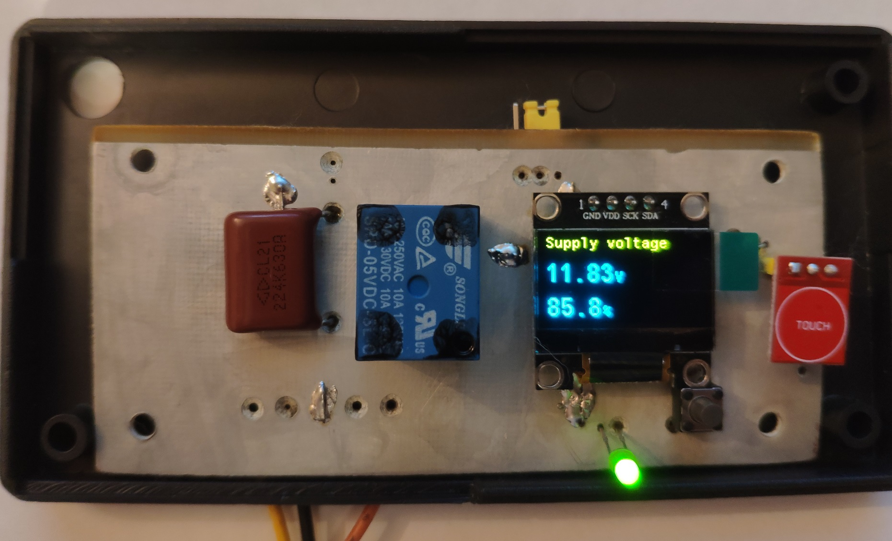
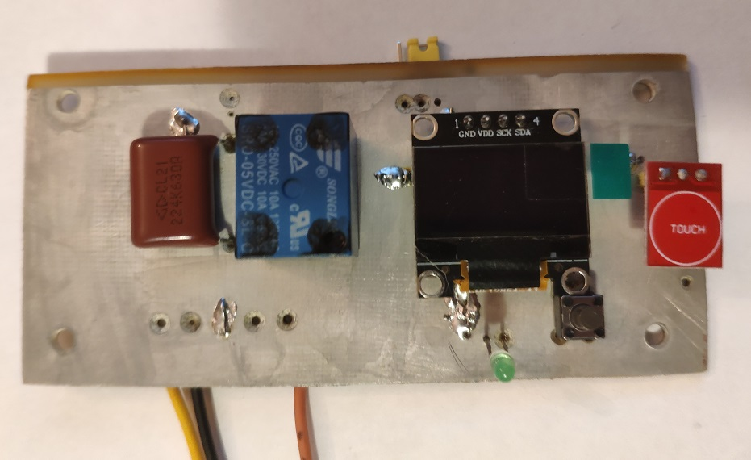

## Turning off the hard drive when the battery is low

My DVR is powered by 12 volts.
When the power is turned off,
 the device is powered by a lithium battery.

If the battery is discharged to 10 volts, the hard drive starts clicking.
To prevent this from happening, we turn off the DVR's power at 10 volts.

If the battery is discharged below the threshold set in the program,
 the relay is switched off.
If it reaches the value, when powered by an external power supply,
 the load turns on.

 The device is assembled on the STM32F103C8T6 microcontroller and
 oled display ssd1306.

To extinguish the spark of the relay contacts when switching the current to 2.5 A, it is used 
A chain of a resistor(1.2k/3) and a capacitor(0.22mkf)

The program has delays in switching on.
The indicator turns on by pressing the touch button,
and goes out after the time has elapsed.

The printed circuit board (included in the project) is made using
 thermal transfer paper. 
 The copper is removed in ferric chloride.
The paths are covered with tin, by chemical tinning.

The firmware is loaded via UART.

The relay is higher than the box, I had to make a hole.
